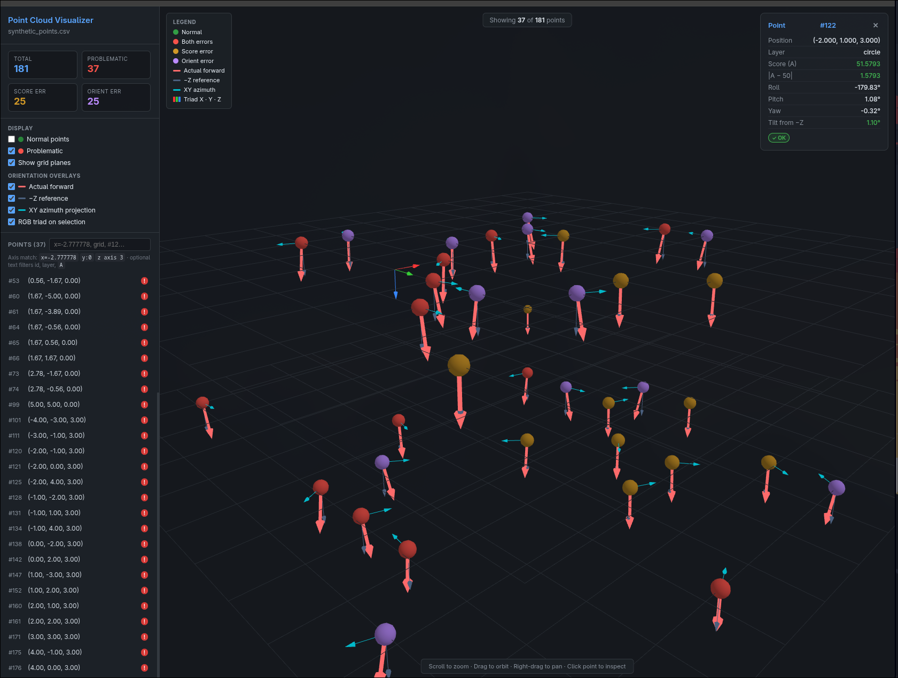
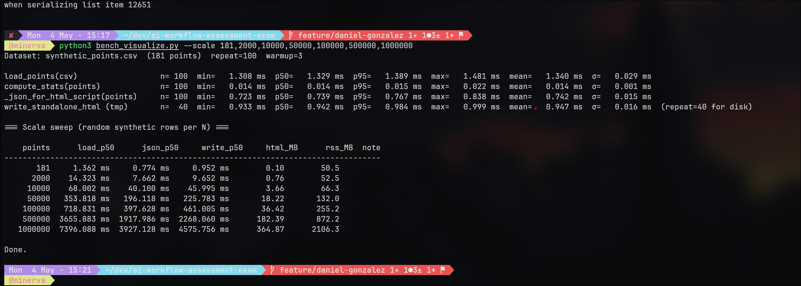

# Solution — Point cloud visualizer

This document satisfies the assessment **deliverables**: how to run the tool, design rationale, AI usage, at least one **design iteration** record, and **stress-test** results.

---

## Screenshots

**UI — problematic points, orientation overlays, detail panel**



**Bench — microbench + scale sweep to 1M random synthetic rows**



---

## 1. How to run locally

### Generate data

```bash
python3 generate_data.py
# → synthetic_points.csv (default)
python3 generate_data.py --output my_points.csv
```

### Dependencies

- **Python:** `fastapi`, `uvicorn` (for the API server path).
- **Browser:** modern Chromium/Firefox/WebKit with **ES modules** and **WebGL** (Three.js).

Install, then from the repository root:

```bash
pip install -r requirements.txt
```

*(Equivalent: `pip install fastapi uvicorn`.)*

### Visualizer (FastAPI + static UI)

```bash
python3 visualize.py
# Open http://127.0.0.1:8000/
```

Options:

```bash
python3 visualize.py --csv synthetic_points.csv   # default
python3 visualize.py --port 8080 --host 127.0.0.1
```

### Standalone HTML (no API)

Embeds points + stats into one file; still serve over **HTTP** (ES module imports from CDN):

```bash
python3 visualize.py --standalone report.html
cd /path/containing/report.html && python3 -m http.server 8000
# → http://127.0.0.1:8000/report.html
```

### Optional benchmark

```bash
python3 bench_visualize.py
python3 bench_visualize.py --scale 181,2000,10000 --no-micro
```

---

## 2. Design choices (short)

| Area | Decision |
|------|-----------|
| **Stack** | **FastAPI** serves precomputed JSON (`/api/points`, `/api/stats`) once at startup; **Three.js** (module + import map) for 3D in the browser. Avoids heavy Python plotting deps while keeping full orbit/zoom/pan. |
| **World frame** | **Z-up** in the viewer (`camera.up`), consistent with CSV `z` layering (grid vs circle). Forward tilt in data is measured vs world **−Z** (nominal boresight “down”). |
| **Problematic** | Matches the brief: `abs(A - 50) > 5` and/or tilt from **−Z** &gt; 5°; four-way colour encoding (ok / score only / orient only / both). |
| **Overlays** | Post–POC: **actual forward** arrow, optional **−Z reference**, **XY azimuth** projection, optional **RGB triad** on selection—trade clarity vs clutter; toggles stay off by default except forward. |
| **Search** | Plain substring on concatenated fields was weak; added **axis predicates** (`x=-2.777778`, `y:0`, `z axis 3`) with float tolerance plus remaining free text on id/layer/`A`. |
| **Standalone** | Same HTML template; empty JSON script tags filled by `visualize.py --standalone` for environments where a Python API is unnecessary. |

Distributed deployments would usually host data **externally**; here CSV is **local** input, which is acceptable for the assessment scope.

---

## 3. AI usage (brief)

- Used an AI assistant to **bootstrap** the FastAPI + static Three.js layout, OrbitControls wiring, and initial sphere rendering.
- Iterated on **UX**: sidebar stats, list filtering, detail panel, colour semantics, overlay toggles, and **axis-aware search** with concrete regex/parser behaviour.
- Used AI to add **`--standalone` export**, embed JSON safety (`</` escaping), and the **`bench_visualize.py`** harness (microbench, scale sweep with `generate_data.generate_rows_for_count`, sequential degrade, temp CSV cleanup).
- All **problem definitions**, thresholds, and **`generate_data.py`** semantics were taken from the README / provided script; AI did not replace reading the CSV schema or the spec.
- Each Commit is tied to a corresponding prompt

---

## 4. Design iteration (required record)

### What needed improvement (and why)

1. **Search** — Listing `id x y z` substring match made coordinate-style queries (`x` at a given value) unreliable; reviewers need to slice the cloud by **plane** (e.g. constant **Y**).
2. **Orientation** — A single forward arrow does not show **roll** or relation to **nominal −Z**; hard to validate “tilt from −Z” visually without extra cues.
3. **Delivery** — Some environments may prefer a **single artifact** without running FastAPI.

### Prompts (representative)

- *“Search isn’t great—support filtering by axis, e.g. all points at x = −2.777778.”*
- *“Add orientation overlays: nominal −Z reference, XY azimuth projection, optional triad on selection.”*
- *“Add a flag to run without an API—embed data in HTML for static hosting.”*

### After


*Example state: “Normal points” off, only **problematic** points shown (37/181); forward / −Z / XY overlays on; point **#122** detail (circle layer, score and Euler/tilt).*

### What improved

- **Search** supports **`x=` / `y:` / `z axis`** predicates ± tolerance and combines with text filters; 3D visibility follows the same filter.
- **Overlays** make misalignment vs **−Z** and horizontal **azimuth** visible without reading degrees first.
- **`--standalone`** produces one shareable HTML file (still opened via a static HTTP server because of ES modules).

---

## 5. Stress test results

Command (microbench on default CSV + scale sweep to **1e6** random synthetic rows per step):

```bash
python3 bench_visualize.py --scale 181,2000,10000,50000,100000,500000,1000000
```

Terminal capture:


### Microbench (`n=100`, `warmup=3`, default `synthetic_points.csv`, ~181 points)

| Step | n | p50 |
|------|---|-----|
| `load_points(csv)` | 100 | 1.329 ms |
| `compute_stats(points)` | 100 | 0.014 ms |
| `_json_for_html_script(points)` | 100 | 0.739 ms |
| `write_standalone_html` (tmp) | 40 | 0.942 ms |

### Scale sweep (random synthetic rows per **N**; median timings; HTML size and RSS after load)

| points | load_p50 | json_p50 | write_p50 | html_MB | rss_MB |
|--------|----------|----------|-----------|---------|--------|
| 181 | 1.362 ms | 0.774 ms | 0.952 ms | 0.10 | 50.5 |
| 2000 | 14.323 ms | 7.662 ms | 9.652 ms | 0.76 | 52.5 |
| 10000 | 68.002 ms | 40.100 ms | 45.995 ms | 3.66 | 66.3 |
| 50000 | 353.818 ms | 196.118 ms | 225.783 ms | 18.22 | 132.0 |
| 100000 | 718.831 ms | 397.628 ms | 461.005 ms | 36.42 | 255.2 |
| 500000 | 3655.883 ms | 1917.986 ms | 2268.060 ms | 182.39 | 872.2 |
| 1000000 | 7396.088 ms | 3927.128 ms | 4575.756 ms | 364.87 | 2106.3 |

**Reading:** load, JSON embed, and standalone write grow roughly **linearly** with **N**; at **1M** rows, load ~**7.4 s**, standalone HTML ~**365 MB**, process RSS ~**2.1 GB**—acceptable for a local stress probe, not a production payload for in-browser JSON embedding without chunking or a binary format.

---

## Existing utilities (personal notes /  reminders) (`generate_data.py`)

- **`build_forward(tilt_deg, azimuth_deg)`**
  - **tilt** — how far off vertical.
  - **azimuth** — compass direction of that tilt.

- **`build_pose(rng, is_orientation_error)`**
  - Produces final **roll, pitch, yaw**.
    - Normal points → small tilt (`0–4°`).
    - Error points → larger tilt (`6–12°`).
    - Calls **`build_forward(...)`** for a forward vector.
    - Converts forward to Euler angles via **`euler_zyx_from_forward(...)`**.

- **`build_a_value(rng, is_error)`**
  - **Normal rows** → within ±4 of target.
  - **Error rows** → between 5.5 and 10 away from target.

## Visual tool (FastAPI + static frontend)

- First pass: Python solution with **FastAPI** and a **static** frontend.
- **Desirable?** For **distributed** setups, points are often **not** local; many modern stacks keep data **external**. For this scope, **local CSV + server** is acceptable for now.

## Three.js

- Skeptical at first.
- **WebGL** is a hard dependency.
  - Reasonable to assume target systems have **WebGL** (many Linux apps ship via **Electron** in practice — still worth calling out).
  - Reference: [threepipe.org — exporting files](https://threepipe.org/guide/exporting-files.html) uses it; acceptable precedent for 3D in the browser.

## Post-POC UI

- Added **orientation overlays** (e.g. **XY azimuth projection**) for extra detail when needed.

## Search

- Default text search was weak; **coordinate-aware** search is preferable.
  - Example: restrict to **Y = B** (with tolerance), i.e. “give the point **⟨A, B, C⟩**” style queries.
  - Current pattern:

    ```js
    const AXIS_SEARCH_RE = /\b([xyz])\s*(?::|=\s*|axis\s+)?\s*([-+]?\d*\.?\d+(?:e[-+]?\d+)?)\b/gi;
    ```

  - Works well enough; could be revisited. Natural evolution: **predicates** (e.g. points inside a circle).

## Standalone mode

- Support running **without** the API when it isn’t needed:

  ```bash
  python3 visualize.py --standalone report.html
  ```

## Stress test (`bench_visualize.py`)

- Extra surface area, but main goal was **how load time scales with N** (tested up to **1 million**).
- **Microbench:** time **`load_points`**, **stats**, **JSON**, and **standalone HTML write** on your CSV many times (spread + median).
- **Scale sweep:** for each **N**, build a **random N-row** temp CSV; time **load → JSON → HTML** vs size.
- **Degrade:** **`load_points`** on the **same file**, **K** times in a row; compare **p50** across **windows** to the first window (watch for slowdown).
- **`--degrade-points`:** same degrade loop on a **large random** CSV so each load does more work.
